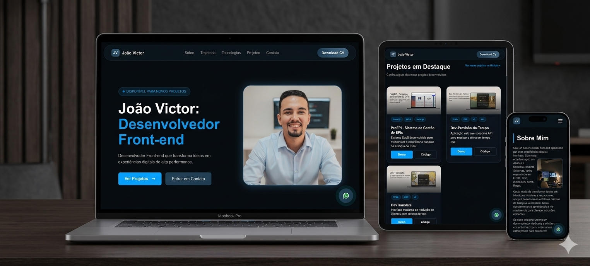

# 💼 Portfólio - João Victor | DesenvolvedorFront-end 

Este repositório contém o código do meu portfólio profissional, desenvolvido para apresentar meus projetos, habilidades e evolução como desenvolvedor Front-end.

## 📸 Preview do Projeto

## 🚀 Sobre o Projeto

Este projeto foi desenvolvido durante meus estudos em programação para consolidar conhecimentos em desenvolvimento web e criar um espaço profissional para apresentar meus trabalhos.

O portfólio possui:

- Layout moderno e responsivo
- Seção de projetos com demonstração e código
- Formulário de contato funcional
- Integração para envio de e-mails com EmailJS
- Botão de contato direto via WhatsApp
- Deploy em produção

---

## 🛠️ Tecnologias Utilizadas

- HTML5
- CSS3
- JavaScript
- EmailJS
- Vercel (Deploy)

---

## 📂 Estrutura do Projeto

Portifolio/
│
├── assets/
│   ├── images/
│   ├── icons/
│
├── css/
│   └── style.css
│
├── js/
│   └── scripts.js
│
├── cv/
│
├── index.html
└── README.md

---

## 💻 Projetos em Destaque

### 🔹 ProEPI - Sistema de Gestão de EPIs
Sistema desenvolvido para simplificar o controle de estoque de equipamentos de proteção individual.

### 🔹 Dev Previsão do Tempo
Aplicação web que consome uma API para mostrar informações climáticas em tempo real.

### 🔹 DevTranslate
Interface moderna para tradução de idiomas com suporte a síntese de voz.

---

## 📬 Contato

📧 Email: moraisvictorpro@gmail.com  
💼 LinkedIn: https://www.linkedin.com/in/joao-victor-devs/  

---

## 📄 Licença

Este projeto está sob a licença MIT.  
Sinta-se livre para utilizá-lo como inspiração para seus próprios projetos.